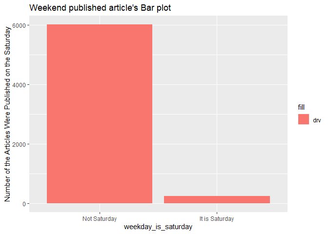

Project3
================
Ruben Sowah,Zhiyuan Yang
2022-10-30

# Introduction

The dataset that we used is called Online News Popularity Data set. This
dataset concluded multiple features of articles published by Mashable in
past years. Our goal is to use different predictive models to predict
the number of shares in social networks. Our target variable is the
number of shares. The variable name of our target variable is called
shares. Thus, shares will be our dependent variable in our predictive
models. After our discussion, we both think the rate of unique words in
the content, the number of links, the number of images, the number of
videos, whether the article was published on the weekend, the rate of
positive words in the content, the rate of negative words in the
content, the average polarity of positive words, the average polarity of
negative words, whether the article published on Monday or on a Saturday
will affect the number of shares for article. Thus, we selected \*\*
n_tokens_content, num_hrefs, num_imgs, num_videos, is_weekend,
global_rate_positive_words, global_rate_negative_words,
avg_positive_polarity, avg_negative_polarity, weekday_is_monday,
weekday_is_saturday \*\* as our independent variables.

This dataset has six different channels, which are a lifestyle channel,
an entertainment channel, a bus channel, a social media channel, a tech
channel, and a world channel. We will subset the dataset based on
different channel types before we create our predictive models.

We will fit a random forest model and fit a boosted tree model. Both
models will be chosen using cross-validation. We will describe those in
more detail later.

# Load packages

``` r
library(tidyverse)
library(caret)
library(Metrics)
library(ggplot2)
library(readr)
library(corrplot)
library(knitr)
library(rsample)
library(randomForest)
library(rmarkdown)
library(tibble)
library(haven)
```

# Read in the data

``` r
## Read and get an overview of the data
newsdata <- read_csv("OnlineNewsPopularity.csv")
#newsdata <- read_csv("C:\\Users\\zyang\\Desktop\\OnlineNewsPopularity\\OnlineNewsPopularity.csv")
head(newsdata)

## Subset the data by the channels, and select our desired features
newsdata <- newsdata %>% 
        filter(!!rlang::sym(params$chan) == 1) %>%
        select(n_tokens_content,num_hrefs,num_imgs, num_videos,weekday_is_monday,weekday_is_saturday,is_weekend,global_rate_positive_words,global_rate_negative_words,avg_positive_polarity,avg_negative_polarity,shares)#,data_channel_is_entertainment,data_channel_is_world) 
        
## Coerce the categorical variables into factor
newsdata$weekday_is_monday <- factor(newsdata$weekday_is_monday, levels = c(0,1), labels = c('Not Monday', 'It is Monday'))

newsdata$weekday_is_saturday <- factor(newsdata$weekday_is_saturday, levels = c(0,1), labels = c('Not Saturday', 'It is Saturday'))

newsdata$is_weekend <- factor(newsdata$is_weekend, levels = c(0,1), labels = c('Not a weekend', 'Weekend'))

## View data
print(newsdata, width = 100, n = 10)
```

# First group member’s summarizations

<br>

#### <u>1) Numerical summaries</u>

Here I will get some numerical summaries like the mean, the standard
deviation , the variance of some of the quantitative variables as well
as get the count of the categorical variables.

``` r
## Get the numerical summaries of some numeric features
num.summary <- newsdata %>%
          summarize(tokens.avg = mean(n_tokens_content), image.avg = mean(num_imgs), vids.avg = mean(num_videos), pos.words.dev = sd(global_rate_positive_words), links.var = var(num_hrefs))

num.summary

## Get contingency tables of the categorical features

# Count of the articles published and not on Monday
table(newsdata$weekday_is_monday)
```

    ## 
    ##   Not Monday It is Monday 
    ##         5105         1153

``` r
# Two ways table of articles published on weekend and on Saturday or neither.
table(newsdata$is_weekend, newsdata$weekday_is_saturday)
```

    ##                
    ##                 Not Saturday It is Saturday
    ##   Not a weekend         5672              0
    ##   Weekend                343            243

- From the numerical summaries, the results show that there is an
  average of 607 words in the content, an average of 6 images and 3
  videos. The standard deviation of the positive words from the mean is
  0.0169 and the number of links varies by a average amount of 167.

- The one way contingency table tells us that the number of articles
  published on Monday is less compared to the number of articles that is
  not published on Monday, 1358 versus 5699.

- From the two ways contingency tables, 536 articles are published
  during the weekend, but it is not on Saturday. The amount of articles
  published on Saturday is 380. A total number of 6141 articles are not
  published during the weekend.

#### <u>2) Graphs</u>

- **Scatter plot of the rate of positive words in the content and the
  number of shares**

``` r
g <- ggplot(newsdata, aes(x = global_rate_positive_words, y = shares))
g + geom_point(color = 'blue')+
  labs(title = 'Rate of positive words vs Number of shares')
```

<!-- -->

A scatter plot is used to visualize the relation between two numeric
variables. A strong positive relationship between the rate of positive
words and the number of shares will show a linear upward trend with the
data points closed to each other. This means that the number of shares
grows as the number of positive words increases.

A negative relationship between the two variables is shown by a downward
trend that tells us that people share less contents that have lots of
positive words.

- **Density plot**

``` r
g <- ggplot(newsdata, aes(x = global_rate_negative_words)) 
g + geom_density(kernel ='gaussian', color = 'red', size = 2)+
  labs(title = 'Density plot  of the rate of negative words in the article')
```

<!-- -->

A density plot can tell us about the distribution of a certain feature
or the whole data. Here, we plot the density of the rate of negative
words. A right skewed plot is an indication that there are quite more
negative words in the article. A left skewed plot indicates that there
are not much of negative words in the article. A symmetric plot tells us
that the amount of negative words in the article is normally
distributed, about average.

<br>

- **Dotplot**

``` r
g <- ggplot(newsdata, aes(x = is_weekend, y = shares)) 
g + geom_dotplot(binaxis = "y", stackdir = 'center', color = 'magenta', dotsize = 1.2)+
  labs(title = 'Dotplot of the number of articles shared vs the week of the day')
```

<!-- -->

- Similarly to a boxplot, dotplots can be used to visualize the five
  number summary of a numeric data. Here , we are trying to see
  graphically the number of contents shared during the weekday and the
  weekend. We would expect the minimum number to be 0, since a the least
  amount of contents that can be shared can’t go below 0.

- A greater number of points, for example in the ‘Not weekend’ group
  states that more articles are shared during the week days compared the
  weekend. The opposite would mean that contents are shared more during
  the weekend.

- Points that are far away from the rest indicates possible outliers.

# First group member’s modeling

Here the data will be split into two, a training set and a testing set.
Two different models will be fit on the training set , then later be
evaluated on the test set. The two models that will be fit are a
**linear regression model** and a **random forest model**, using
cross-validation.

- **What is linear regression about ?**

Linear regression (LR) is the simplest form of a supervised machine
learning, where the data has both a single (simple linear regression) or
numerous predictors variables (multiple linear regression) denoted X’s
and an outcome or response variable denoted Y, that is quantitative.
Linear regression is used for either predicting the response variable or
to understand the relationship between the response and the predictors.
In the former case, we talk about prediction and in the latter, we talk
about inference.

Though a very simple approach , LR is widely used in practice and lots
of advanced models are a generalization of LR. With LR, one can seek to
understand if there is a relation between the response and the
predictors, and how strong that relationship is. Which predictors are
associated with the response, how accurately can one predicts the
response, is the relationship linear or non-linear, are the predictors
correlated? Those are some important questions one can answers with the
use of linear regression.

- **What is random forest about ?**

Random forest (RF) is supervised statistical machine learning algorithm
, constructed from decision trees, that is used in regression and
classification problems. RF is part of a general learning method called
*ensemble learning*. The idea of ensemble learning is to build a
prediction model by combining the strengths of a collection of simpler
base models, or in layman terms, an ensemble learning simply means
combining multiple models.

RF builds decision trees on different samples and takes their majority
vote for classification and average for regression. It is an extension
of another ensemble learning method called *Bagging or Bootstrap
Aggregation*. Bagging chooses a random sample from the data, and
generates different models from those samples called Bootstrap samples,
the sample is usually done with replacement.

Rf is an extension of Bagging in the sense that RF doesn’t use all the
predictors unlike Bagging. It uses a random subset of predictors for
each bootstrap sample, and the final output is based on the average or
majority ranking, in this way the problem of overfitting is also
avoided.

#### <u>**1) Fit a linear regression model**</u>

The data now will be split into a train and test sets, and a multiple
linear regression model will be fit on the train set. The train set will
be 70 percent of the whole data and the remaining 30 % will be the test
set.

``` r
## Set a seed for reproducible random numbers
set.seed(12)

## Using the rsample package, create a training an test set (70/30)
index <- initial_split(newsdata, prop = 0.7)
train.set <- training(index)
test.set <- testing(index)

## Fit a linear regression model
regmod <- train(shares ~. ,
                data = train.set,
                method = 'lm',
                preProcess = c('center','scale'),
                trControl = trainControl(method = 'cv', number = 5)
                )
summary(regmod)
```

    ## 
    ## Call:
    ## lm(formula = .outcome ~ ., data = dat)
    ## 
    ## Residuals:
    ##    Min     1Q Median     3Q    Max 
    ## -21834  -2321  -1224    -16 682456 
    ## 
    ## Coefficients:
    ##                                     Estimate Std. Error t value Pr(>|t|)    
    ## (Intercept)                           3177.5      253.9  12.514  < 2e-16 ***
    ## n_tokens_content                      -473.0      321.6  -1.471 0.141468    
    ## num_hrefs                              444.7      320.8   1.386 0.165683    
    ## num_imgs                               122.8      267.1   0.460 0.645768    
    ## num_videos                             844.6      261.3   3.232 0.001238 ** 
    ## `weekday_is_mondayIt is Monday`        634.8      257.4   2.466 0.013691 *  
    ## `weekday_is_saturdayIt is Saturday`    161.7      320.2   0.505 0.613640    
    ## is_weekendWeekend                      185.7      326.9   0.568 0.569970    
    ## global_rate_positive_words             127.5      262.2   0.486 0.626876    
    ## global_rate_negative_words             229.0      267.2   0.857 0.391495    
    ## avg_positive_polarity                 -145.2      259.1  -0.560 0.575296    
    ## avg_negative_polarity                 -963.4      270.1  -3.567 0.000365 ***
    ## ---
    ## Signif. codes:  0 '***' 0.001 '**' 0.01 '*' 0.05 '.' 0.1 ' ' 1
    ## 
    ## Residual standard error: 16800 on 4368 degrees of freedom
    ## Multiple R-squared:  0.009589,   Adjusted R-squared:  0.007094 
    ## F-statistic: 3.844 on 11 and 4368 DF,  p-value: 1.539e-05

#### <u>**2) Fit a random forest model**</u>

Here a random forest model will be fit on the train set using a
cross-validation with 5 folds. We will use the expand.grid() function to
select a range of parameters that will be tuned in our model. The
optimal parameter that minimizes th error will be chosen and the model
will be refit on the train set using that optimal parameter. We will
also center and scale the train data for a more accurate distribution of
the variables.

``` r
## Create a grid of tuning parameters
forestgrid <- expand.grid(mtry = c(1:20))

## Fit the random forest model
forestmod <- train(shares ~ . ,
                   data = train.set,
                   method = 'rf',
                   trControl = trainControl(method = 'cv', number= 5),
                   preProcess = c('center','scale'),
                   tuneGrid = forestgrid)
forestmod

## Get the optimal tuned parameter
mtry.opt <- forestmod$bestTune$mtry

## Refit the random forest model on the train set using the optimal tuned parameter
forest.tuned <-  train(shares ~ . ,
                   data = train.set,
                   method = 'rf',
                   trControl = trainControl(method = 'cv', number= 5),
                   preProcess = c('center','scale'),
                   tuneGrid = expand.grid(mtry = mtry.opt))
```

# Second group member’s summarizations

``` r
# Create contingency table of whether the article was published on the weekend
table(newsdata$is_weekend)
```

    ## 
    ## Not a weekend       Weekend 
    ##          5672           586

***Comments:*** Based on the contingency table, we can see how many
articles are published on weekend. 0 means articles are not published on
weekend. 1 means articles are published on weekend.

``` r
# Create contingency table of whether the article was published on the Saturday
table(newsdata$weekday_is_saturday)
```

    ## 
    ##   Not Saturday It is Saturday 
    ##           6015            243

***Comments:*** Based on the contingency table, we can see how many
articles are published on Saturday. 0 means articles are not published
on Saturday. 1 means articles are published on Saturday.

``` r
# Create bar plot to see whether the article was published on the Saturday

ggplot(newsdata, aes(x=weekday_is_saturday))+
  geom_bar(aes(fill = "drv")) + 
  labs(y="Number of the Articles Were Published on the Saturday", 
       title= "Weekend published article's Bar plot")
```

<!-- -->
***Comments:*** Based on the bar plot, we can see how many articles are
published on Saturday.

``` r
# Create histogram to see number of shares and whether the article was published on the Weekend

ggplot(data = newsdata, aes(x = shares))+ 
  geom_histogram(bins = 20, aes(fill = is_weekend)) +
  labs(x = "Number of Shares",
       y="Number of the Articles Were Published on the Weekend", 
       title = "Histogram of Shares that are Related to Weekend") +
       scale_fill_discrete(name = "Whether Weekend Published", 
                           labels = c("No", "Yes"))
```

<!-- -->

***Comments:*** Based on this histogram, we can see the distribution of
the number of shares. If the peak of the graph lies to the left side of
the center, it means that most of articles have small number of shares.
If the peak of the graph lies to the right side of the center, it means
that most of articles have large number of shares. If we see a bell
shape, it means that the number of articles have large number of shares
is similar with the number of articles have small number of shares. The
No means the articles were published on weekend. The Yes means the
articles were published on weekend.

``` r
g <- ggplot(newsdata, aes(x = n_tokens_content, y = shares))
g + geom_point(color = 'green')+
  labs(title = 'number of tokens content vs Number of shares')
```

<!-- -->

***Comments:*** Based on this scatter plot, we can see how many points
plotted in the Cartesian plane. Each point represents the values of
number of shares and number of token content. The closer the data points
come to forming a straight line when plotted, it means that number of
shares and number of token content have stronger the relationship. If
the data points make a straight line going from near the origin out to
high y-values, variables will have a positive correlation.

# Second group member’s modeling

#### <u>Fit another linear regression model</u>

``` r
regmod2 <- train(shares~(n_tokens_content+num_hrefs+num_imgs+num_videos+global_rate_positive_words+
                           global_rate_negative_words+
                           avg_positive_polarity+avg_negative_polarity)^2+
                           weekday_is_monday+weekday_is_saturday+
                          is_weekend,
                 data = train.set,
                 method = "lm",
                 preProcess = c("center", "scale"),
                 trControl = trainControl(method = "cv", number = 10))

summary(regmod2)
```

    ## 
    ## Call:
    ## lm(formula = .outcome ~ ., data = dat)
    ## 
    ## Residuals:
    ##    Min     1Q Median     3Q    Max 
    ## -45904  -2185  -1022    209 675571 
    ## 
    ## Coefficients:
    ##                                                         Estimate Std. Error t value Pr(>|t|)    
    ## (Intercept)                                              3177.47     253.01  12.559  < 2e-16 ***
    ## n_tokens_content                                        -2172.53    2669.74  -0.814 0.415827    
    ## num_hrefs                                                -430.05    2348.66  -0.183 0.854726    
    ## num_imgs                                                 1973.55    1576.07   1.252 0.210566    
    ## num_videos                                               2961.87    3809.40   0.778 0.436897    
    ## global_rate_positive_words                              -1266.83    1087.41  -1.165 0.244083    
    ## global_rate_negative_words                              -1596.66    1314.05  -1.215 0.224406    
    ## avg_positive_polarity                                     -35.73     695.01  -0.051 0.959002    
    ## avg_negative_polarity                                   -3858.96    1203.94  -3.205 0.001359 ** 
    ## `weekday_is_mondayIt is Monday`                           625.12     257.72   2.426 0.015325 *  
    ## `weekday_is_saturdayIt is Saturday`                       179.04     320.47   0.559 0.576410    
    ## is_weekendWeekend                                         153.49     329.26   0.466 0.641118    
    ## `n_tokens_content:num_hrefs`                              600.90     635.62   0.945 0.344523    
    ## `n_tokens_content:num_imgs`                              -328.25     546.96  -0.600 0.548441    
    ## `n_tokens_content:num_videos`                           -2587.73     748.73  -3.456 0.000553 ***
    ## `n_tokens_content:global_rate_positive_words`             563.00    1488.46   0.378 0.705270    
    ## `n_tokens_content:global_rate_negative_words`             202.24    1068.95   0.189 0.849953    
    ## `n_tokens_content:avg_positive_polarity`                 2889.40    2281.51   1.266 0.205423    
    ## `n_tokens_content:avg_negative_polarity`                 1907.48    1373.36   1.389 0.164929    
    ## `num_hrefs:num_imgs`                                      130.23     462.32   0.282 0.778198    
    ## `num_hrefs:num_videos`                                   -543.29     556.20  -0.977 0.328733    
    ## `num_hrefs:global_rate_positive_words`                     95.09    1269.05   0.075 0.940276    
    ## `num_hrefs:global_rate_negative_words`                      1.14     841.55   0.001 0.998919    
    ## `num_hrefs:avg_positive_polarity`                        1203.07    2122.37   0.567 0.570844    
    ## `num_hrefs:avg_negative_polarity`                         856.31    1211.31   0.707 0.479647    
    ## `num_imgs:num_videos`                                    -115.01     338.99  -0.339 0.734431    
    ## `num_imgs:global_rate_positive_words`                    -534.53     823.49  -0.649 0.516307    
    ## `num_imgs:global_rate_negative_words`                    -168.13     667.98  -0.252 0.801283    
    ## `num_imgs:avg_positive_polarity`                        -2877.93    1430.15  -2.012 0.044247 *  
    ## `num_imgs:avg_negative_polarity`                        -1927.36     819.09  -2.353 0.018665 *  
    ## `num_videos:global_rate_positive_words`                 -1742.27    1589.34  -1.096 0.273044    
    ## `num_videos:global_rate_negative_words`                  2287.84     978.77   2.337 0.019461 *  
    ## `num_videos:avg_positive_polarity`                      -4312.85    3210.29  -1.343 0.179198    
    ## `num_videos:avg_negative_polarity`                      -4502.30    1967.43  -2.288 0.022161 *  
    ## `global_rate_positive_words:global_rate_negative_words`  -469.85     817.46  -0.575 0.565476    
    ## `global_rate_positive_words:avg_positive_polarity`       1510.99    1145.60   1.319 0.187257    
    ## `global_rate_positive_words:avg_negative_polarity`       -532.11     894.72  -0.595 0.552062    
    ## `global_rate_negative_words:avg_positive_polarity`       1414.15    1219.77   1.159 0.246374    
    ## `global_rate_negative_words:avg_negative_polarity`      -1050.82     751.06  -1.399 0.161849    
    ## `avg_positive_polarity:avg_negative_polarity`            4030.01    1269.83   3.174 0.001516 ** 
    ## ---
    ## Signif. codes:  0 '***' 0.001 '**' 0.01 '*' 0.05 '.' 0.1 ' ' 1
    ## 
    ## Residual standard error: 16740 on 4340 degrees of freedom
    ## Multiple R-squared:  0.02293,    Adjusted R-squared:  0.01415 
    ## F-statistic: 2.612 on 39 and 4340 DF,  p-value: 2.05e-07

#### What is a boosted tree model?

The boosted tree model is a general approach that can be applied to
trees. Trees grown sequentially and each subsequent tree is grown on a
modified version of original data. When tree growing, the predictions
also are updated. Thus, it solves errors that created by previous
decision trees. Boosting transforms weak decision trees, which are weak
learners into strong learners. Boosting is an iterative process. Each
tree is dependent on the previous tree. For the procedure, we can
initialize predictions as 0, and Find the residuals
(observed-predicted), call the set of them r. And then we fit a tree
with splits (terminal nodes) treating the residuals as the response,
which they are for the first fit. After that, we can update predictions
and update residuals for new predictions and repeat B times.

#### <u>Fit a boosted tree model</u>

``` r
boosted_fit <- train(shares ~., data = train.set, method = "gbm",
                       trControl = trainControl(method = "repeatedcv", 
                                                number = 5, repeats = 3),
                       preProcess = c("center", "scale"),
                       tuneGrid = expand.grid(n.trees = c(25, 50, 100, 150, 200, 250),
                                              interaction.depth = 1:5,
                                              shrinkage = 0.1,
                                              n.minobsinnode = 10),
                       verbose = FALSE)
boosted_fit
```

    ## Stochastic Gradient Boosting 
    ## 
    ## 4380 samples
    ##   11 predictor
    ## 
    ## Pre-processing: centered (11), scaled (11) 
    ## Resampling: Cross-Validated (5 fold, repeated 3 times) 
    ## Summary of sample sizes: 3505, 3504, 3503, 3505, 3503, 3504, ... 
    ## Resampling results across tuning parameters:
    ## 
    ##   interaction.depth  n.trees  RMSE      Rsquared     MAE     
    ##   1                   25      15380.89  0.004486065  2981.456
    ##   1                   50      15440.73  0.005426780  3006.870
    ##   1                  100      15468.83  0.007360970  3058.228
    ##   1                  150      15519.24  0.007154489  3080.393
    ##   1                  200      15514.11  0.008070195  3105.712
    ##   1                  250      15499.20  0.009261019  3110.226
    ##   2                   25      15416.26  0.004365986  2979.876
    ##   2                   50      15563.26  0.005342032  3043.829
    ##   2                  100      15738.91  0.006368224  3133.413
    ##   2                  150      15818.60  0.009762785  3191.367
    ##   2                  200      16043.89  0.007995194  3298.187
    ##   2                  250      16080.46  0.008552141  3352.663
    ##   3                   25      15504.56  0.003913709  3009.292
    ##   3                   50      15656.04  0.005414580  3079.756
    ##   3                  100      15913.09  0.006818305  3197.026
    ##   3                  150      16112.58  0.007009465  3304.939
    ##   3                  200      16249.81  0.006671005  3398.737
    ##   3                  250      16482.33  0.005678692  3518.719
    ##   4                   25      15454.67  0.005968862  3000.646
    ##   4                   50      15640.61  0.005722153  3062.222
    ##   4                  100      15888.35  0.008461699  3256.347
    ##   4                  150      16142.00  0.007959492  3401.820
    ##   4                  200      16336.75  0.007099284  3536.951
    ##   4                  250      16462.71  0.008161911  3618.453
    ##   5                   25      15444.91  0.007672817  3010.935
    ##   5                   50      15669.69  0.007103770  3116.895
    ##   5                  100      15997.30  0.007518275  3311.696
    ##   5                  150      16167.45  0.006403607  3469.335
    ##   5                  200      16487.60  0.005486069  3648.676
    ##   5                  250      16593.07  0.005981701  3715.939
    ## 
    ## Tuning parameter 'shrinkage' was held constant at a value of 0.1
    ## Tuning parameter 'n.minobsinnode'
    ##  was held constant at a value of 10
    ## RMSE was used to select the optimal model using the smallest value.
    ## The final values used for the model were n.trees = 25, interaction.depth = 1, shrinkage = 0.1
    ##  and n.minobsinnode = 10.

# Comparison of the four models

We will predict the four models fitted above on the test set and use the
postResample() function to get the test metrics. We are more concerned
about the root mean squared error (RMSE) as the measure of our models.

``` r
## Predict the multiple regression fit on the test set
regmod.pred <- predict(regmod, newdata = test.set)

## Get the RMSE of the regression model
regmod.rmse <- postResample(regmod.pred, test.set$shares)[1]

## Predict the RF model on the test set 
forest.pred <- predict(forest.tuned, newdata = test.set)

## Get the RMSE of the Random Forest model
forest.rmse <- postResample(forest.pred, test.set$shares)[1]

## Predict the second linear regression model on the test set
regmod2.pred <- predict(regmod2, newdata = test.set)

## Get the RMSE of the second linear regression model
regmod2.rmse <- postResample(regmod2.pred, test.set$shares)[1]

## Predict the boosted tree model on the test set
boosted.pred <- predict(boosted_fit, newdata = test.set)

## Get the RMSE of the boosted tree model
boosted.rmse <- postResample(boosted.pred, test.set$shares)[1]

## Combine the four RMSE in a table
data.frame(Regression = regmod.rmse,
           Forest = forest.rmse,
           Pol.regression = regmod2.rmse,
           Boosted.tree = boosted.rmse)
```

The **random forest** model has the lowest root mean squared error of
all four models, with a value of **7951.099**, hence is our winner
model.

# Automation

``` r
channels <- c("data_channel_is_lifestyle", "data_channel_is_entertainment", "data_channel_is_bus", "data_channel_is_socmed", "data_channel_is_tech", "data_channel_is_world")

## Files
output_file <- paste0(channels,".md")

## Create a list for each channel with just channel name parameter
 params = lapply(channels, FUN = function(x){
 
   return(list(chan = x))

})
## Put into a data frame
reports = tibble(channels, output_file, params);reports

## Automation

apply(reports, MARGIN = 1, FUN = function(x){

  rmarkdown::render(input = "Project3.Rmd",

                    output_format = "github_document",

                    output_file = x[[2]],

                    params = x[[3]],

                    output_options = list(html_preview = FALSE))

})
```
