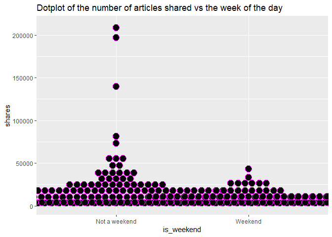

Project3
================
Ruben Sowah, Zhiyuan Yang
2022-10-30

- <a href="#data_channel_is_lifestyle-s-analysis"
  id="toc-data_channel_is_lifestyle-s-analysis"><strong>DATA_CHANNEL_IS_LIFESTYLE
  ’s Analysis</strong></a>
- <a href="#introduction" id="toc-introduction">Introduction</a>
- <a href="#load-packages" id="toc-load-packages">Load packages</a>
- <a href="#read-in-the-data" id="toc-read-in-the-data">Read in the
  data</a>
- <a href="#summarizations" id="toc-summarizations">Summarizations</a>
  - <a href="#first-group-member" id="toc-first-group-member">First group
    member</a>
  - <a href="#second-group-member" id="toc-second-group-member">Second group
    member</a>
- <a href="#modeling" id="toc-modeling">Modeling</a>
- <a href="#comparison-of-the-four-models"
  id="toc-comparison-of-the-four-models">Comparison of the four models</a>
- <a href="#automation" id="toc-automation">Automation</a>

# **DATA_CHANNEL_IS_LIFESTYLE ’s Analysis**

# Introduction

The dataset that we used is called Online News Popularity Data set. This
dataset concluded multiple features of articles published by Mashable in
past years. Our goal is to use different predictive models to predict
the number of shares in social networks. Our target variable is the
number of shares. The variable name of our target variable is called
shares. Thus, shares will be our dependent variable in our predictive
models. After our discussion, we both think the rate of unique words in
the content, the number of links, the number of images, the number of
videos, whether the article was published on the weekend, the rate of
positive words in the content, the rate of negative words in the
content, the average polarity of positive words, the average polarity of
negative words, whether the article published on Monday or on a Saturday
will affect the number of shares for article. Thus, we selected \*\*
n_tokens_content, num_hrefs, num_imgs, num_videos, is_weekend,
global_rate_positive_words, global_rate_negative_words,
avg_positive_polarity, avg_negative_polarity, weekday_is_monday,
weekday_is_saturday \*\* as our independent variables.

This dataset has six different channels, which are a lifestyle channel,
an entertainment channel, a bus channel, a social media channel, a tech
channel, and a world channel. We will subset the dataset based on
different channel types before we create our predictive models.

We will fit a random forest model and fit a boosted tree model. Both
models will be chosen using cross-validation. We will describe those in
more detail later.

# Load packages

``` r
library(tidyverse)
library(caret)
library(Metrics)
library(ggplot2)
library(readr)
library(knitr)
library(rsample)
library(randomForest)
library(rmarkdown)
library(tibble)
library(haven)
```

# Read in the data

``` r
## Read and get an overview of the data
newsdata <- read_csv("OnlineNewsPopularity.csv")
head(newsdata)

## Subset the data by the channels, and select our desired features
newsdata <- newsdata %>% 
        filter(!!rlang::sym(params$chan) == 1) %>%
        select(n_tokens_content,num_hrefs,num_imgs, num_videos,weekday_is_monday,weekday_is_saturday,is_weekend,global_rate_positive_words,global_rate_negative_words,avg_positive_polarity,avg_negative_polarity,shares)
        
## Coerce the categorical variables into factors
newsdata$weekday_is_monday <- factor(newsdata$weekday_is_monday, levels = c(0,1), labels = c('Not Monday', 'It is Monday'))

newsdata$weekday_is_saturday <- factor(newsdata$weekday_is_saturday, levels = c(0,1), labels = c('Not Saturday', 'It is Saturday'))

newsdata$is_weekend <- factor(newsdata$is_weekend, levels = c(0,1), labels = c('Not a weekend', 'Weekend'))

## View data
print(newsdata, width = 100, n = 10)
```

# Summarizations

## First group member

#### <u>1) Numerical summaries</u>

Here I will get some numerical summaries like the mean, the standard
deviation , the variance of some of the quantitative variables as well
as get the count of the categorical variables.

``` r
## Get the numerical summaries of some numeric features
num.summary <- newsdata %>%
          summarize(tokens.avg = mean(n_tokens_content), image.avg = mean(num_imgs), vids.avg = mean(num_videos), pos.words.dev = sd(global_rate_positive_words), links.var = var(num_hrefs))

num.summary

## Get contingency tables of the categorical features

# Count of the articles published and not on Monday
tab1 <- table(newsdata$weekday_is_monday); tab1
```

    ## 
    ##   Not Monday It is Monday 
    ##         1777          322

``` r
# Two ways table of articles published on weekend and on Saturday or neither.
tab2 <- table(newsdata$is_weekend, newsdata$weekday_is_saturday); tab2
```

    ##                
    ##                 Not Saturday It is Saturday
    ##   Not a weekend         1707              0
    ##   Weekend                210            182

- From the numerical summaries, the results show that there is an
  average of 621 words in the content, an average of 5 images and 0
  videos. The standard deviation of the positive words from the mean is
  0 and the number of links varies by a average amount of 133.

- The one way contingency table tells us that the number of articles
  published on Monday is 322 and the number of articles that is not
  published on Monday is 1777.

- From the two ways contingency tables, 210 articles are published
  during the weekend, but it is not on Saturday. The amount of articles
  published on Saturday is 182. A total number of 1707 articles are not
  published during the weekend.

#### <u>2) Graphs</u>

- **Scatter plot of the rate of positive words in the content and the
  number of shares**

``` r
g <- ggplot(newsdata, aes(x = global_rate_positive_words, y = shares))
g + geom_point(color = 'blue')+
  labs(title = 'Rate of positive words vs Number of shares')
```

<!-- -->

A scatter plot is used to visualize the relation between two numeric
variables. A strong positive relationship between the rate of positive
words and the number of shares will show a linear upward trend with the
data points closed to each other. This means that the number of shares
grows as the number of positive words increases.

A negative relationship between the two variables is shown by a downward
trend that tells us that people share less contents that have lots of
positive words.

- **Density plot**

``` r
g <- ggplot(newsdata, aes(x = global_rate_negative_words)) 
g + geom_density(kernel ='gaussian', color = 'red', size = 2)+
  labs(title = 'Density plot  of the rate of negative words in the article')
```

<!-- -->

A density plot can tell us about the distribution of a certain feature
or the whole data. Here, we plot the density of the rate of negative
words. A right skewed plot is an indication that there are quite more
negative words in the article. A left skewed plot indicates that there
are not much of negative words in the article. A symmetric plot tells us
that the amount of negative words in the article is normally
distributed, about average.

<br>

- **Dotplot**

``` r
g <- ggplot(newsdata, aes(x = is_weekend, y = shares)) 
g + geom_dotplot(binaxis = "y", stackdir = 'center', color = 'magenta', dotsize = 1.2)+
  labs(title = 'Dotplot of the number of articles shared vs the week of the day')
```

<!-- -->

- Similarly to a boxplot, dotplots can be used to visualize the five
  number summary of a numeric data. Here , we are trying to see
  graphically the number of contents shared during the weekday and the
  weekend. We would expect the minimum number to be 0, since the least
  amount of contents to be shared can’t go below 0.

- A greater number of points, for example in the ‘Not weekend’ group
  states that more articles are shared during the week days compared the
  weekend. The opposite would mean that contents are shared more during
  the weekend.

- Points that are far away from the rest indicates possible outliers.

## Second group member

#### <u>3) Numerical summaries</u>

``` r
## Quantitative summary
summary <- newsdata %>%
          summarize(tokens.med = median(n_tokens_content), image.sd = sd(num_imgs), pos.words.avg = mean(global_rate_positive_words))

summary

# Create contingency table of whether the article was published on the weekend
tab3 <- table(newsdata$is_weekend); tab3
```

    ## 
    ## Not a weekend       Weekend 
    ##          1707           392

***Comments:***

The tokens have a median value of 502 , the number of images have a
standard deviation of 8, and the mean of the positive words is 0.

Based on the contingency table, we can see that 392 articles are
published on weekend versus 1707 published during the week days.

``` r
# Create contingency table of whether the article was published on the Saturday
tab4 <- table(newsdata$weekday_is_saturday); tab4
```

    ## 
    ##   Not Saturday It is Saturday 
    ##           1917            182

***Comments:*** Based on the contingency table, we can see that 182
articles are published on Saturday, and 1917 articles are not published
on Saturday.

<br>

#### <u>4) Graphs</u>

- **Barplot of the day the article was published**

``` r
# Create bar plot to see whether the article was published on the Saturday

ggplot(newsdata, aes(x=weekday_is_saturday))+
  geom_bar(aes(fill = weekday_is_saturday)) + 
  labs(y="Number of the Articles Were Published on the Saturday", 
       title= "Weekend published article's Bar plot")
```

<!-- -->
***Comments:***  
A higher bar indicates that articles are more published during this time
period as opposed to a lower bar which indicates aricles are less
published during this period.

- **Histogram of the number of shares vs the amount of articles
  published in the weekend**

``` r
# Create histogram to see number of shares and whether the article was published on the Weekend

ggplot(data = newsdata, aes(x = shares))+ 
  geom_histogram(bins = 20, aes(fill = is_weekend)) +
  labs(x = "Number of Shares",
       y="Number of the Articles Were Published on the Weekend", 
       title = "Histogram of Shares that are Related to Weekend") +
       scale_fill_discrete(name = "Whether Weekend Published", 
                           labels = c("No", "Yes"))
```

<!-- -->

***Comments:*** Based on this histogram, we can see the distribution of
the number of shares. If the peak of the graph lies to the left side of
the center, it means that most of articles have small number of shares.
If the peak of the graph lies to the right side of the center, it means
that most of articles have large number of shares. If we see a bell
shape, it means that the number of articles have large number of shares
is similar with the number of articles have small number of shares. The
No means the articles were published on weekend. The Yes means the
articles were published on weekend.

- **Scatter plot of the number of tokens content and the number of
  shares**

``` r
g <- ggplot(newsdata, aes(x = n_tokens_content, y = shares))
g + geom_point(color = 'green')+
  labs(title = 'number of tokens content vs Number of shares')
```

<!-- -->

***Comments:*** Based on this scatter plot, we can see how many points
plotted in the Cartesian plane. Each point represents the values of
number of shares and number of token content. The closer the data points
come to forming a straight line when plotted, it means that number of
shares and number of token content have stronger the relationship. If
the data points make a straight line going from near the origin out to
high y-values, variables will have a positive correlation.

# Modeling

Here the data will be split into two, a training set and a testing set.
Four different models will be fit on the training set , then later be
evaluated on the test set. The four models that will be fit are a
**linear regression model** ,a **polynomial regression model** ,a
**random forest model**, and a **boosted tree model** using
cross-validation.

- **What is linear regression about ?**

Linear regression (LR) is the simplest form of a supervised machine
learning, where the data has both a single (simple linear regression) or
numerous predictors variables (multiple linear regression) denoted X’s
and an outcome or response variable denoted Y, that is quantitative.
Linear regression is used for either predicting the response variable or
to understand the relationship between the response and the predictors.
In the former case, we talk about prediction and in the latter, we talk
about inference.

Though a very simple approach , LR is widely used in practice and lots
of advanced models are a generalization of LR. With LR, one can seek to
understand if there is a relation between the response and the
predictors, and how strong that relationship is. Which predictors are
associated with the response, how accurately can one predicts the
response, is the relationship linear or non-linear, are the predictors
correlated? Those are some important questions one can answers with the
use of linear regression.

- **What is random forest about ?**

Random forest (RF) is supervised statistical machine learning algorithm
, constructed from decision trees, that is used in regression and
classification problems. RF is part of a general learning method called
*ensemble learning*. The idea of ensemble learning is to build a
prediction model by combining the strengths of a collection of simpler
base models, or in layman terms, an ensemble learning simply means
combining multiple models.

RF builds decision trees on different samples and takes their majority
vote for classification and average for regression. It is an extension
of another ensemble learning method called *Bagging or Bootstrap
Aggregation*. Bagging chooses a random sample from the data, and
generates different models from those samples called Bootstrap samples,
the sample is usually done with replacement.

Rf is an extension of Bagging in the sense that RF doesn’t use all the
predictors unlike Bagging. It uses a random subset of predictors for
each bootstrap sample, and the final output is based on the average or
majority ranking, in this way the problem of overfitting is also
avoided.

#### <u>**1) Fit a linear regression model**</u>

The data now will be split into a train and test sets, and a multiple
linear regression model will be fit on the train set. The train set will
be 70 percent of the whole data and the remaining 30 % will be the test
set.

``` r
## Set a seed for reproducible random numbers
set.seed(12)

## Using the rsample package, create a training an test set (70/30)
index <- initial_split(newsdata, prop = 0.7)
train.set <- training(index)
test.set <- testing(index)

## Fit a linear regression model
regmod <- train(shares ~. ,
                data = train.set,
                method = 'lm',
                preProcess = c('center','scale'),
                trControl = trainControl(method = 'cv', number = 5)
                )
summary(regmod)
```

    ## 
    ## Call:
    ## lm(formula = .outcome ~ ., data = dat)
    ## 
    ## Residuals:
    ##    Min     1Q Median     3Q    Max 
    ## -23522  -2529  -1622   -115 204635 
    ## 
    ## Coefficients:
    ##                                     Estimate Std. Error t value Pr(>|t|)    
    ## (Intercept)                          3681.47     255.00  14.437  < 2e-16 ***
    ## n_tokens_content                      504.05     294.14   1.714   0.0868 .  
    ## num_hrefs                             210.86     293.85   0.718   0.4731    
    ## num_imgs                              164.64     313.65   0.525   0.5997    
    ## num_videos                           1165.56     257.75   4.522 6.62e-06 ***
    ## `weekday_is_mondayIt is Monday`       434.19     260.27   1.668   0.0955 .  
    ## `weekday_is_saturdayIt is Saturday`    88.53     337.82   0.262   0.7933    
    ## is_weekendWeekend                     -59.00     348.92  -0.169   0.8658    
    ## global_rate_positive_words           -173.40     265.62  -0.653   0.5140    
    ## global_rate_negative_words            273.78     266.31   1.028   0.3041    
    ## avg_positive_polarity                 -82.21     276.48  -0.297   0.7662    
    ## avg_negative_polarity                -290.13     264.99  -1.095   0.2738    
    ## ---
    ## Signif. codes:  0 '***' 0.001 '**' 0.01 '*' 0.05 '.' 0.1 ' ' 1
    ## 
    ## Residual standard error: 9773 on 1457 degrees of freedom
    ## Multiple R-squared:  0.02363,    Adjusted R-squared:  0.01626 
    ## F-statistic: 3.206 on 11 and 1457 DF,  p-value: 0.0002521

#### <u>**2) Fit a random forest model**</u>

Here a random forest model will be fit on the train set using a
cross-validation with 5 folds. We will use the expand.grid() function to
select a range of parameters that will be tuned in our model. The
optimal parameter that minimizes th error will be chosen and the model
will be refit on the train set using that optimal parameter. We will
also center and scale the train data for a more accurate distribution of
the variables.

``` r
## Create a grid of tuning parameters
forestgrid <- expand.grid(mtry = c(1:20))

## Fit the random forest model
forestmod <- train(shares ~ . ,
                   data = train.set,
                   method = 'rf',
                   trControl = trainControl(method = 'cv', number= 5),
                   preProcess = c('center','scale'),
                   tuneGrid = forestgrid)
forestmod
```

    ## Random Forest 
    ## 
    ## 1469 samples
    ##   11 predictor
    ## 
    ## Pre-processing: centered (11), scaled (11) 
    ## Resampling: Cross-Validated (5 fold) 
    ## Summary of sample sizes: 1176, 1175, 1175, 1176, 1174 
    ## Resampling results across tuning parameters:
    ## 
    ##   mtry  RMSE       Rsquared     MAE     
    ##    1     9178.206  0.006636536  3322.656
    ##    2     9245.370  0.007498207  3419.729
    ##    3     9271.851  0.013458730  3450.075
    ##    4     9302.407  0.021741020  3458.192
    ##    5     9383.969  0.020327904  3478.301
    ##    6     9489.578  0.017770963  3511.406
    ##    7     9599.258  0.013788036  3527.698
    ##    8     9779.062  0.022666029  3584.591
    ##    9     9882.330  0.011440225  3608.310
    ##   10    10030.152  0.010028826  3620.024
    ##   11    10150.129  0.009357799  3638.572
    ##   12    10186.455  0.011692343  3644.875
    ##   13    10170.033  0.008310418  3644.568
    ##   14    10139.200  0.007465516  3626.903
    ##   15    10115.075  0.011655250  3633.136
    ##   16    10194.515  0.009239985  3642.446
    ##   17    10185.331  0.009114017  3630.430
    ##   18    10234.954  0.010872686  3649.274
    ##   19    10133.906  0.007445995  3636.602
    ##   20    10145.321  0.007135163  3625.869
    ## 
    ## RMSE was used to select the optimal model using the smallest value.
    ## The final value used for the model was mtry = 1.

``` r
## Get the optimal tuned parameter
mtry.opt <- forestmod$bestTune$mtry

## Refit the random forest model on the train set using the optimal tuned parameter
forest.tuned <-  train(shares ~ . ,
                   data = train.set,
                   method = 'rf',
                   trControl = trainControl(method = 'cv', number= 5),
                   preProcess = c('center','scale'),
                   tuneGrid = expand.grid(mtry = mtry.opt))
```

#### <u>**3) Fit a polynomial linear regression model**</u>

We will fit a polynomial regression model to the train set.

``` r
regmod2 <- train(shares~(n_tokens_content+num_hrefs+num_imgs+num_videos+global_rate_positive_words+
                           global_rate_negative_words+
                           avg_positive_polarity+avg_negative_polarity)^2+
                           weekday_is_monday+weekday_is_saturday+
                          is_weekend,
                 data = train.set,
                 method = "lm",
                 preProcess = c("center", "scale"),
                 trControl = trainControl(method = "cv", number = 10))

summary(regmod2)
```

    ## 
    ## Call:
    ## lm(formula = .outcome ~ ., data = dat)
    ## 
    ## Residuals:
    ##    Min     1Q Median     3Q    Max 
    ## -33746  -2518  -1282    391 202309 
    ## 
    ## Coefficients:
    ##                                                         Estimate Std. Error t value Pr(>|t|)    
    ## (Intercept)                                              3681.47     244.34  15.067  < 2e-16 ***
    ## n_tokens_content                                        -9296.56    2634.30  -3.529  0.00043 ***
    ## num_hrefs                                               -1296.39    1789.82  -0.724  0.46899    
    ## num_imgs                                                 1313.07    1167.18   1.125  0.26078    
    ## num_videos                                              -8501.64    1972.93  -4.309 1.75e-05 ***
    ## global_rate_positive_words                               -869.36    1184.48  -0.734  0.46309    
    ## global_rate_negative_words                               -878.94    1512.03  -0.581  0.56113    
    ## avg_positive_polarity                                    -163.17     698.66  -0.234  0.81537    
    ## avg_negative_polarity                                    -498.46    1117.73  -0.446  0.65569    
    ## `weekday_is_mondayIt is Monday`                           424.94     252.16   1.685  0.09217 .  
    ## `weekday_is_saturdayIt is Saturday`                        84.00     326.90   0.257  0.79724    
    ## is_weekendWeekend                                         -89.95     341.38  -0.264  0.79220    
    ## `n_tokens_content:num_hrefs`                             3100.00     673.53   4.603 4.54e-06 ***
    ## `n_tokens_content:num_imgs`                             -2164.99     849.05  -2.550  0.01088 *  
    ## `n_tokens_content:num_videos`                            3711.72     600.03   6.186 8.05e-10 ***
    ## `n_tokens_content:global_rate_positive_words`            3350.71    1515.11   2.212  0.02716 *  
    ## `n_tokens_content:global_rate_negative_words`            1579.79     922.46   1.713  0.08701 .  
    ## `n_tokens_content:avg_positive_polarity`                 3666.02    2623.53   1.397  0.16252    
    ## `n_tokens_content:avg_negative_polarity`                 -554.82    1495.22  -0.371  0.71065    
    ## `num_hrefs:num_imgs`                                    -1339.09     635.21  -2.108  0.03520 *  
    ## `num_hrefs:num_videos`                                  -3409.05     459.93  -7.412 2.12e-13 ***
    ## `num_hrefs:global_rate_positive_words`                    391.62    1361.54   0.288  0.77367    
    ## `num_hrefs:global_rate_negative_words`                   1101.55     797.43   1.381  0.16738    
    ## `num_hrefs:avg_positive_polarity`                         727.14    2024.95   0.359  0.71958    
    ## `num_hrefs:avg_negative_polarity`                        1600.06    1229.12   1.302  0.19319    
    ## `num_imgs:num_videos`                                      99.32     317.23   0.313  0.75426    
    ## `num_imgs:global_rate_positive_words`                   -1156.23    1451.11  -0.797  0.42571    
    ## `num_imgs:global_rate_negative_words`                      39.79     789.54   0.050  0.95981    
    ## `num_imgs:avg_positive_polarity`                        -1003.57    1951.91  -0.514  0.60723    
    ## `num_imgs:avg_negative_polarity`                        -3077.88    1454.15  -2.117  0.03446 *  
    ## `num_videos:global_rate_positive_words`                  1448.89     974.28   1.487  0.13720    
    ## `num_videos:global_rate_negative_words`                  -409.74     709.25  -0.578  0.56355    
    ## `num_videos:avg_positive_polarity`                       7799.84    1576.46   4.948 8.40e-07 ***
    ## `num_videos:avg_negative_polarity`                       -226.00    1073.02  -0.211  0.83321    
    ## `global_rate_positive_words:global_rate_negative_words`   -38.91     862.84  -0.045  0.96403    
    ## `global_rate_positive_words:avg_positive_polarity`       -561.26    1326.45  -0.423  0.67227    
    ## `global_rate_positive_words:avg_negative_polarity`       -617.59     854.17  -0.723  0.46978    
    ## `global_rate_negative_words:avg_positive_polarity`        103.50    1315.27   0.079  0.93729    
    ## `global_rate_negative_words:avg_negative_polarity`        -78.28     761.48  -0.103  0.91813    
    ## `avg_positive_polarity:avg_negative_polarity`             825.33    1294.94   0.637  0.52400    
    ## ---
    ## Signif. codes:  0 '***' 0.001 '**' 0.01 '*' 0.05 '.' 0.1 ' ' 1
    ## 
    ## Residual standard error: 9365 on 1429 degrees of freedom
    ## Multiple R-squared:  0.1208, Adjusted R-squared:  0.09676 
    ## F-statistic: 5.032 on 39 and 1429 DF,  p-value: < 2.2e-16

#### <u>**4) Fit a boosted tree model**</u>

- **What is a boosted tree model**?

The boosted tree model is a general approach that can be applied to
trees. Trees grown sequentially and each subsequent tree is grown on a
modified version of original data. When tree growing, the predictions
also are updated. Thus, it solves errors that created by previous
decision trees. Boosting transforms weak decision trees, which are weak
learners into strong learners. Boosting is an iterative process. Each
tree is dependent on the previous tree. For the procedure, we can
initialize predictions as 0, and Find the residuals
(observed-predicted), call the set of them r. And then we fit a tree
with splits (terminal nodes) treating the residuals as the response,
which they are for the first fit. After that, we can update predictions
and update residuals for new predictions and repeat B times.

``` r
boosted_fit <- train(shares ~., data = train.set, method = "gbm",
                       trControl = trainControl(method = "repeatedcv", 
                                                number = 5, repeats = 3),
                       preProcess = c("center", "scale"),
                       tuneGrid = expand.grid(n.trees = c(25, 50, 100, 150, 200, 250),
                                              interaction.depth = 1:5,
                                              shrinkage = 0.1,
                                              n.minobsinnode = 10),
                       verbose = FALSE)
boosted_fit
```

    ## Stochastic Gradient Boosting 
    ## 
    ## 1469 samples
    ##   11 predictor
    ## 
    ## Pre-processing: centered (11), scaled (11) 
    ## Resampling: Cross-Validated (5 fold, repeated 3 times) 
    ## Summary of sample sizes: 1176, 1174, 1175, 1176, 1175, 1175, ... 
    ## Resampling results across tuning parameters:
    ## 
    ##   interaction.depth  n.trees  RMSE      Rsquared     MAE     
    ##   1                   25      9172.138  0.001459911  3373.818
    ##   1                   50      9186.510  0.001861095  3366.704
    ##   1                  100      9250.983  0.001941141  3409.615
    ##   1                  150      9242.373  0.002346227  3432.275
    ##   1                  200      9264.415  0.001914944  3441.107
    ##   1                  250      9270.882  0.001869208  3456.934
    ##   2                   25      9201.441  0.003736968  3412.552
    ##   2                   50      9293.748  0.005576743  3469.679
    ##   2                  100      9367.252  0.004492399  3526.016
    ##   2                  150      9446.621  0.005669598  3605.828
    ##   2                  200      9559.157  0.005354761  3709.785
    ##   2                  250      9628.657  0.004398365  3808.806
    ##   3                   25      9217.694  0.004401285  3411.482
    ##   3                   50      9315.480  0.003850777  3507.722
    ##   3                  100      9453.507  0.003910937  3632.687
    ##   3                  150      9620.786  0.003464226  3801.498
    ##   3                  200      9673.173  0.004621887  3908.677
    ##   3                  250      9769.048  0.004740061  4012.542
    ##   4                   25      9247.172  0.007368632  3465.687
    ##   4                   50      9337.631  0.006745028  3531.675
    ##   4                  100      9498.443  0.005473061  3718.748
    ##   4                  150      9658.527  0.004723366  3872.643
    ##   4                  200      9745.216  0.005257472  4001.601
    ##   4                  250      9809.762  0.005001892  4069.628
    ##   5                   25      9278.336  0.004831606  3516.409
    ##   5                   50      9393.231  0.006751304  3610.336
    ##   5                  100      9567.665  0.007218052  3808.393
    ##   5                  150      9676.482  0.007196024  3926.412
    ##   5                  200      9771.933  0.008473827  4059.942
    ##   5                  250      9860.622  0.008133050  4167.229
    ## 
    ## Tuning parameter 'shrinkage' was held constant at a value of 0.1
    ## Tuning parameter 'n.minobsinnode'
    ##  was held constant at a value of 10
    ## RMSE was used to select the optimal model using the smallest value.
    ## The final values used for the model were n.trees = 25, interaction.depth = 1, shrinkage = 0.1
    ##  and n.minobsinnode = 10.

# Comparison of the four models

We will predict the four models fitted above on the test set and use the
postResample() function to get the test metrics. We are more concerned
about the root mean squared error (RMSE) as the measure of our models.

``` r
## Predict the multiple regression fit on the test set
regmod.pred <- predict(regmod, newdata = test.set)

## Get the RMSE of the regression model
regmod.rmse <- postResample(regmod.pred, test.set$shares)[1]

## Predict the RF model on the test set 
forest.pred <- predict(forest.tuned, newdata = test.set)

## Get the RMSE of the Random Forest model
forest.rmse <- postResample(forest.pred, test.set$shares)[1]

## Predict the polynomial linear regression model on the test set
regmod2.pred <- predict(regmod2, newdata = test.set)

## Get the RMSE of the polynomial linear regression model
regmod2.rmse <- postResample(regmod2.pred, test.set$shares)[1]

## Predict the boosted tree model on the test set
boosted.pred <- predict(boosted_fit, newdata = test.set)

## Get the RMSE of the boosted tree model
boosted.rmse <- postResample(boosted.pred, test.set$shares)[1]

## Combine the four RMSE in a table
kable(data.frame(Regression = regmod.rmse,
                      Random.Forest = forest.rmse,
                      Polynomial.Regression = regmod2.rmse,
                      Boosted.tree = boosted.rmse))
```

|      | Regression | Random.Forest | Polynomial.Regression | Boosted.tree |
|:-----|-----------:|--------------:|----------------------:|-------------:|
| RMSE |   6292.235 |       6085.46 |               13959.5 |     6136.125 |

The **Random.Forest** model has the lowest root mean squared error of
all four models, with a value of **6085.46**, hence is our winner model.

# Automation

``` r
channels <- c("data_channel_is_lifestyle", "data_channel_is_entertainment", "data_channel_is_bus", "data_channel_is_socmed", "data_channel_is_tech", "data_channel_is_world")

## Files
output_file <- paste0(channels,".md")

## Create a list for each channel with just channel name parameter
 params = lapply(channels, FUN = function(x){
 
   return(list(chan = x))

})
 
## Put into a data frame
reports = tibble(channels, output_file, params);reports

## Automation

apply(reports, MARGIN = 1, FUN = function(x){

  rmarkdown::render(input = "Project3.Rmd",

                    output_format = "github_document",

                    output_file = x[[2]],

                    params = x[[3]],

                    output_options = list(html_preview = FALSE))

})
```
