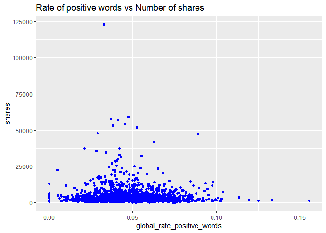
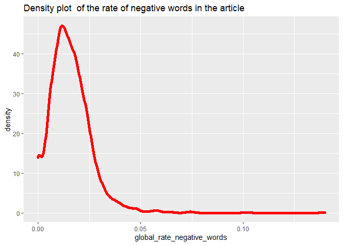
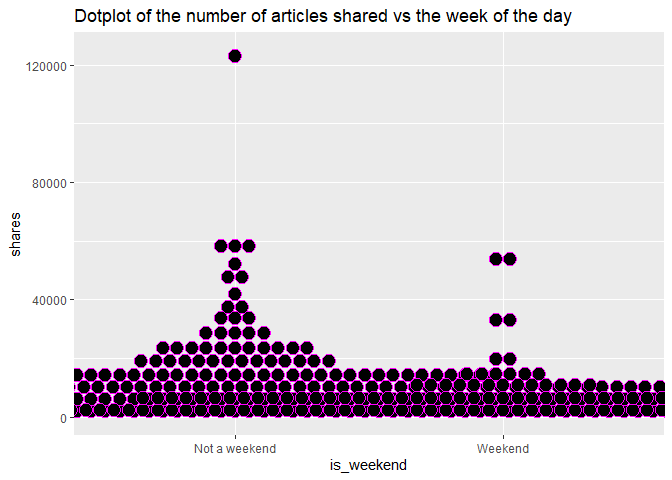
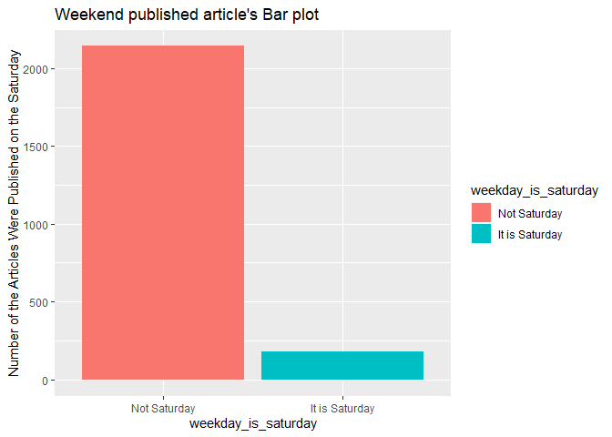
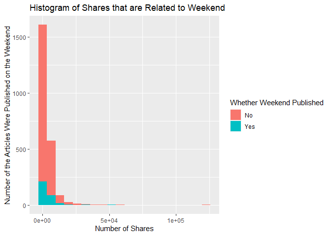
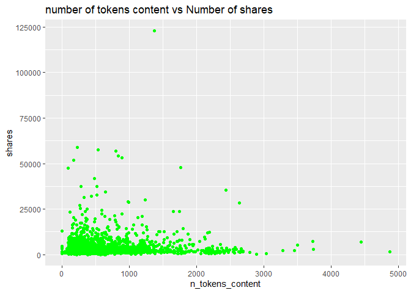

Project3
================
Ruben Sowah, Zhiyuan Yang
2022-10-30

- <a href="#data_channel_is_socmed-s-analysis"
  id="toc-data_channel_is_socmed-s-analysis"><strong>DATA_CHANNEL_IS_SOCMED
  ’s Analysis</strong></a>
- <a href="#introduction" id="toc-introduction">Introduction</a>
- <a href="#load-packages" id="toc-load-packages">Load packages</a>
- <a href="#read-in-the-data" id="toc-read-in-the-data">Read in the
  data</a>
- <a href="#summarizations" id="toc-summarizations">Summarizations</a>
  - <a href="#first-group-member" id="toc-first-group-member">First group
    member</a>
  - <a href="#second-group-member" id="toc-second-group-member">Second group
    member</a>
- <a href="#modeling" id="toc-modeling">Modeling</a>
- <a href="#comparison-of-the-four-models"
  id="toc-comparison-of-the-four-models">Comparison of the four models</a>
- <a href="#automation" id="toc-automation">Automation</a>

# **DATA_CHANNEL_IS_SOCMED ’s Analysis**

# Introduction

The dataset that we used is called Online News Popularity Data set. This
dataset concluded multiple features of articles published by Mashable in
past years. Our goal is to use different predictive models to predict
the number of shares in social networks. Our target variable is the
number of shares. The variable name of our target variable is called
shares. Thus, shares will be our dependent variable in our predictive
models. After our discussion, we both think the rate of unique words in
the content, the number of links, the number of images, the number of
videos, whether the article was published on the weekend, the rate of
positive words in the content, the rate of negative words in the
content, the average polarity of positive words, the average polarity of
negative words, whether the article published on Monday or on a Saturday
will affect the number of shares for article. Thus, we selected \*\*
n_tokens_content, num_hrefs, num_imgs, num_videos, is_weekend,
global_rate_positive_words, global_rate_negative_words,
avg_positive_polarity, avg_negative_polarity, weekday_is_monday,
weekday_is_saturday \*\* as our independent variables.

This dataset has six different channels, which are a lifestyle channel,
an entertainment channel, a bus channel, a social media channel, a tech
channel, and a world channel. We will subset the dataset based on
different channel types before we create our predictive models.

We will fit a random forest model and fit a boosted tree model. Both
models will be chosen using cross-validation. We will describe those in
more detail later.

# Load packages

``` r
library(tidyverse)
library(caret)
library(Metrics)
library(ggplot2)
library(readr)
library(knitr)
library(rsample)
library(randomForest)
library(rmarkdown)
library(tibble)
library(haven)
```

# Read in the data

``` r
## Read and get an overview of the data
newsdata <- read_csv("OnlineNewsPopularity.csv")
head(newsdata)

## Subset the data by the channels, and select our desired features
newsdata <- newsdata %>% 
        filter(!!rlang::sym(params$chan) == 1) %>%
        select(n_tokens_content,num_hrefs,num_imgs, num_videos,weekday_is_monday,weekday_is_saturday,is_weekend,global_rate_positive_words,global_rate_negative_words,avg_positive_polarity,avg_negative_polarity,shares)
        
## Coerce the categorical variables into factors
newsdata$weekday_is_monday <- factor(newsdata$weekday_is_monday, levels = c(0,1), labels = c('Not Monday', 'It is Monday'))

newsdata$weekday_is_saturday <- factor(newsdata$weekday_is_saturday, levels = c(0,1), labels = c('Not Saturday', 'It is Saturday'))

newsdata$is_weekend <- factor(newsdata$is_weekend, levels = c(0,1), labels = c('Not a weekend', 'Weekend'))

## View data
print(newsdata, width = 100, n = 10)
```

# Summarizations

## First group member

#### <u>1) Numerical summaries</u>

Here I will get some numerical summaries like the mean, the standard
deviation , the variance of some of the quantitative variables as well
as get the count of the categorical variables.

``` r
## Get the numerical summaries of some numeric features
num.summary <- newsdata %>%
          summarize(tokens.avg = mean(n_tokens_content), image.avg = mean(num_imgs), vids.avg = mean(num_videos), pos.words.dev = sd(global_rate_positive_words), links.var = var(num_hrefs))

num.summary

## Get contingency tables of the categorical features

# Count of the articles published and not on Monday
tab1 <- table(newsdata$weekday_is_monday); tab1
```

    ## 
    ##   Not Monday It is Monday 
    ##         1986          337

``` r
# Two ways table of articles published on weekend and on Saturday or neither.
tab2 <- table(newsdata$is_weekend, newsdata$weekday_is_saturday); tab2
```

    ##                
    ##                 Not Saturday It is Saturday
    ##   Not a weekend         2006              0
    ##   Weekend                137            180

- From the numerical summaries, the results show that there is an
  average of 609.6280672 words in the content, an average of 4.2901421
  images and 1.1175204 videos. The standard deviation of the positive
  words from the mean is 0.0169597 and the number of links varies by a
  average amount of 241.08742.

- The one way contingency table tells us that the number of articles
  published on Monday is 337 and the number of articles that is not
  published on Monday is 1986.

- From the two ways contingency tables, 137 articles are published
  during the weekend, but it is not on Saturday. The amount of articles
  published on Saturday is 180. A total number of 2006 articles are not
  published during the weekend.

#### <u>2) Graphs</u>

- **Scatter plot of the rate of positive words in the content and the
  number of shares**

``` r
g <- ggplot(newsdata, aes(x = global_rate_positive_words, y = shares))
g + geom_point(color = 'blue')+
  labs(title = 'Rate of positive words vs Number of shares')
```

<!-- -->

A scatter plot is used to visualize the relation between two numeric
variables. A strong positive relationship between the rate of positive
words and the number of shares will show a linear upward trend with the
data points closed to each other. This means that the number of shares
grows as the number of positive words increases.

A negative relationship between the two variables is shown by a downward
trend that tells us that people share less contents that have lots of
positive words.

- **Density plot**

``` r
g <- ggplot(newsdata, aes(x = global_rate_negative_words)) 
g + geom_density(kernel ='gaussian', color = 'red', size = 2)+
  labs(title = 'Density plot  of the rate of negative words in the article')
```

<!-- -->

A density plot can tell us about the distribution of a certain feature
or the whole data. Here, we plot the density of the rate of negative
words. A right skewed plot is an indication that there are quite more
negative words in the article. A left skewed plot indicates that there
are not much of negative words in the article. A symmetric plot tells us
that the amount of negative words in the article is normally
distributed, about average.

<br>

- **Dotplot**

``` r
g <- ggplot(newsdata, aes(x = is_weekend, y = shares)) 
g + geom_dotplot(binaxis = "y", stackdir = 'center', color = 'magenta', dotsize = 1.2)+
  labs(title = 'Dotplot of the number of articles shared vs the week of the day')
```

<!-- -->

- Similarly to a boxplot, dotplots can be used to visualize the five
  number summary of a numeric data. Here , we are trying to see
  graphically the number of contents shared during the weekday and the
  weekend. We would expect the minimum number to be 0, since a the least
  amount of contents that can be shared can’t go below 0.

- A greater number of points, for example in the ‘Not weekend’ group
  states that more articles are shared during the week days compared the
  weekend. The opposite would mean that contents are shared more during
  the weekend.

- Points that are far away from the rest indicates possible outliers.

## Second group member

#### <u>3) Numerical summaries</u>

``` r
## Quantitative summary
summary <- newsdata %>%
          summarize(tokens.med = median(n_tokens_content), image.sd = sd(num_imgs), pos.words.avg = mean(global_rate_positive_words))

summary

# Create contingency table of whether the article was published on the weekend
tab3 <- table(newsdata$is_weekend); tab3
```

    ## 
    ## Not a weekend       Weekend 
    ##          2006           317

***Comments:***

The tokens have a median value of 434 , the number of images have a
standard deviation of 8.201711, and the mean of the positive words is
0.0466823.

Based on the contingency table, we can see that 317 articles are
published on weekend versus 2006 published during the week days.

``` r
# Create contingency table of whether the article was published on the Saturday
tab4 <- table(newsdata$weekday_is_saturday); tab4
```

    ## 
    ##   Not Saturday It is Saturday 
    ##           2143            180

***Comments:*** Based on the contingency table, we can see that 180
articles are published on Saturday, and `r tab4[1]` articles are not
published on Saturday.

<br>

#### <u>4) Graphs</u>

- **Barplot of the day the article was published**

``` r
# Create bar plot to see whether the article was published on the Saturday

ggplot(newsdata, aes(x=weekday_is_saturday))+
  geom_bar(aes(fill = weekday_is_saturday)) + 
  labs(y="Number of the Articles Were Published on the Saturday", 
       title= "Weekend published article's Bar plot")
```

<!-- -->
***Comments:***  
A higher bar indicates that articles are more published during this time
period as opposed to a lower bar which indicates aricles are less
published during this period.

- **Histogram of the number of shares vs the amount of articles
  published in the weekend**

``` r
# Create histogram to see number of shares and whether the article was published on the Weekend

ggplot(data = newsdata, aes(x = shares))+ 
  geom_histogram(bins = 20, aes(fill = is_weekend)) +
  labs(x = "Number of Shares",
       y="Number of the Articles Were Published on the Weekend", 
       title = "Histogram of Shares that are Related to Weekend") +
       scale_fill_discrete(name = "Whether Weekend Published", 
                           labels = c("No", "Yes"))
```

<!-- -->

***Comments:*** Based on this histogram, we can see the distribution of
the number of shares. If the peak of the graph lies to the left side of
the center, it means that most of articles have small number of shares.
If the peak of the graph lies to the right side of the center, it means
that most of articles have large number of shares. If we see a bell
shape, it means that the number of articles have large number of shares
is similar with the number of articles have small number of shares. The
No means the articles were published on weekend. The Yes means the
articles were published on weekend.

- **Scatter plot of the number of tokens content and the number of
  shares**

``` r
g <- ggplot(newsdata, aes(x = n_tokens_content, y = shares))
g + geom_point(color = 'green')+
  labs(title = 'number of tokens content vs Number of shares')
```

<!-- -->

***Comments:*** Based on this scatter plot, we can see how many points
plotted in the Cartesian plane. Each point represents the values of
number of shares and number of token content. The closer the data points
come to forming a straight line when plotted, it means that number of
shares and number of token content have stronger the relationship. If
the data points make a straight line going from near the origin out to
high y-values, variables will have a positive correlation.

# Modeling

Here the data will be split into two, a training set and a testing set.
Four different models will be fit on the training set , then later be
evaluated on the test set. The four models that will be fit are a
**linear regression model** ,a **polynomial regression model** ,a
**random forest model**, and a **boosted tree model** using
cross-validation.

- **What is linear regression about ?**

Linear regression (LR) is the simplest form of a supervised machine
learning, where the data has both a single (simple linear regression) or
numerous predictors variables (multiple linear regression) denoted X’s
and an outcome or response variable denoted Y, that is quantitative.
Linear regression is used for either predicting the response variable or
to understand the relationship between the response and the predictors.
In the former case, we talk about prediction and in the latter, we talk
about inference.

Though a very simple approach , LR is widely used in practice and lots
of advanced models are a generalization of LR. With LR, one can seek to
understand if there is a relation between the response and the
predictors, and how strong that relationship is. Which predictors are
associated with the response, how accurately can one predicts the
response, is the relationship linear or non-linear, are the predictors
correlated? Those are some important questions one can answers with the
use of linear regression.

- **What is random forest about ?**

Random forest (RF) is supervised statistical machine learning algorithm
, constructed from decision trees, that is used in regression and
classification problems. RF is part of a general learning method called
*ensemble learning*. The idea of ensemble learning is to build a
prediction model by combining the strengths of a collection of simpler
base models, or in layman terms, an ensemble learning simply means
combining multiple models.

RF builds decision trees on different samples and takes their majority
vote for classification and average for regression. It is an extension
of another ensemble learning method called *Bagging or Bootstrap
Aggregation*. Bagging chooses a random sample from the data, and
generates different models from those samples called Bootstrap samples,
the sample is usually done with replacement.

Rf is an extension of Bagging in the sense that RF doesn’t use all the
predictors unlike Bagging. It uses a random subset of predictors for
each bootstrap sample, and the final output is based on the average or
majority ranking, in this way the problem of overfitting is also
avoided.

#### <u>**1) Fit a linear regression model**</u>

The data now will be split into a train and test sets, and a multiple
linear regression model will be fit on the train set. The train set will
be 70 percent of the whole data and the remaining 30 % will be the test
set.

``` r
## Set a seed for reproducible random numbers
set.seed(12)

## Using the rsample package, create a training an test set (70/30)
index <- initial_split(newsdata, prop = 0.7)
train.set <- training(index)
test.set <- testing(index)

## Fit a linear regression model
regmod <- train(shares ~. ,
                data = train.set,
                method = 'lm',
                preProcess = c('center','scale'),
                trControl = trainControl(method = 'cv', number = 5)
                )
summary(regmod)
```

    ## 
    ## Call:
    ## lm(formula = .outcome ~ ., data = dat)
    ## 
    ## Residuals:
    ##    Min     1Q Median     3Q    Max 
    ##  -8068  -2238  -1357    247 117682 
    ## 
    ## Coefficients:
    ##                                     Estimate Std. Error t value Pr(>|t|)    
    ## (Intercept)                         3674.914    143.834  25.550  < 2e-16 ***
    ## n_tokens_content                     754.665    197.310   3.825 0.000136 ***
    ## num_hrefs                           -459.084    212.246  -2.163 0.030689 *  
    ## num_imgs                            -246.071    184.905  -1.331 0.183443    
    ## num_videos                           105.710    147.163   0.718 0.472664    
    ## `weekday_is_mondayIt is Monday`       -8.057    146.217  -0.055 0.956065    
    ## `weekday_is_saturdayIt is Saturday` -226.083    217.523  -1.039 0.298796    
    ## is_weekendWeekend                    305.158    217.956   1.400 0.161679    
    ## global_rate_positive_words           -88.888    146.375  -0.607 0.543759    
    ## global_rate_negative_words           126.236    152.193   0.829 0.406976    
    ## avg_positive_polarity               -310.111    149.097  -2.080 0.037690 *  
    ## avg_negative_polarity               -286.554    152.166  -1.883 0.059858 .  
    ## ---
    ## Signif. codes:  0 '***' 0.001 '**' 0.01 '*' 0.05 '.' 0.1 ' ' 1
    ## 
    ## Residual standard error: 5800 on 1614 degrees of freedom
    ## Multiple R-squared:  0.01857,    Adjusted R-squared:  0.01188 
    ## F-statistic: 2.776 on 11 and 1614 DF,  p-value: 0.001406

#### <u>**2) Fit a random forest model**</u>

Here a random forest model will be fit on the train set using a
cross-validation with 5 folds. We will use the expand.grid() function to
select a range of parameters that will be tuned in our model. The
optimal parameter that minimizes th error will be chosen and the model
will be refit on the train set using that optimal parameter. We will
also center and scale the train data for a more accurate distribution of
the variables.

``` r
## Create a grid of tuning parameters
forestgrid <- expand.grid(mtry = c(1:20))

## Fit the random forest model
forestmod <- train(shares ~ . ,
                   data = train.set,
                   method = 'rf',
                   trControl = trainControl(method = 'cv', number= 5),
                   preProcess = c('center','scale'),
                   tuneGrid = forestgrid)
forestmod
```

    ## Random Forest 
    ## 
    ## 1626 samples
    ##   11 predictor
    ## 
    ## Pre-processing: centered (11), scaled (11) 
    ## Resampling: Cross-Validated (5 fold) 
    ## Summary of sample sizes: 1301, 1300, 1301, 1300, 1302 
    ## Resampling results across tuning parameters:
    ## 
    ##   mtry  RMSE      Rsquared     MAE     
    ##    1    5614.316  0.013963043  2703.799
    ##    2    5675.551  0.009639802  2776.318
    ##    3    5700.863  0.010003631  2805.492
    ##    4    5731.321  0.008821241  2833.372
    ##    5    5753.748  0.007477408  2850.796
    ##    6    5789.178  0.007102036  2880.954
    ##    7    5811.190  0.006185289  2895.482
    ##    8    5816.999  0.005992423  2898.181
    ##    9    5835.158  0.005231642  2909.988
    ##   10    5845.249  0.005225243  2910.248
    ##   11    5869.997  0.004967529  2920.612
    ##   12    5852.589  0.005121955  2923.023
    ##   13    5872.200  0.006606425  2918.324
    ##   14    5864.284  0.005466752  2923.816
    ##   15    5876.462  0.004831589  2928.888
    ##   16    5895.591  0.004196422  2940.058
    ##   17    5862.646  0.005431701  2918.816
    ##   18    5879.667  0.004697123  2927.954
    ##   19    5864.265  0.005224373  2924.036
    ##   20    5846.195  0.004775053  2917.340
    ## 
    ## RMSE was used to select the optimal model using the smallest value.
    ## The final value used for the model was mtry = 1.

``` r
## Get the optimal tuned parameter
mtry.opt <- forestmod$bestTune$mtry

## Refit the random forest model on the train set using the optimal tuned parameter
forest.tuned <-  train(shares ~ . ,
                   data = train.set,
                   method = 'rf',
                   trControl = trainControl(method = 'cv', number= 5),
                   preProcess = c('center','scale'),
                   tuneGrid = expand.grid(mtry = mtry.opt))
```

#### <u>**3) Fit a polynomial linear regression model**</u>

We will fit a polynomial regression model to the train set.

``` r
regmod2 <- train(shares~(n_tokens_content+num_hrefs+num_imgs+num_videos+global_rate_positive_words+
                           global_rate_negative_words+
                           avg_positive_polarity+avg_negative_polarity)^2+
                           weekday_is_monday+weekday_is_saturday+
                          is_weekend,
                 data = train.set,
                 method = "lm",
                 preProcess = c("center", "scale"),
                 trControl = trainControl(method = "cv", number = 10))

summary(regmod2)
```

    ## 
    ## Call:
    ## lm(formula = .outcome ~ ., data = dat)
    ## 
    ## Residuals:
    ##    Min     1Q Median     3Q    Max 
    ## -10222  -2243  -1204    520 116230 
    ## 
    ## Coefficients:
    ##                                                         Estimate Std. Error t value Pr(>|t|)    
    ## (Intercept)                                              3674.91     143.14  25.674  < 2e-16 ***
    ## n_tokens_content                                         2990.08    1577.13   1.896 0.058155 .  
    ## num_hrefs                                                -442.06    1755.37  -0.252 0.801203    
    ## num_imgs                                                 1034.42    1258.38   0.822 0.411182    
    ## num_videos                                              -2377.56    1107.26  -2.147 0.031925 *  
    ## global_rate_positive_words                                924.18     506.73   1.824 0.068368 .  
    ## global_rate_negative_words                               -178.17     637.01  -0.280 0.779746    
    ## avg_positive_polarity                                    -727.86     381.87  -1.906 0.056829 .  
    ## avg_negative_polarity                                     159.77     662.03   0.241 0.809333    
    ## `weekday_is_mondayIt is Monday`                           -14.50     146.79  -0.099 0.921349    
    ## `weekday_is_saturdayIt is Saturday`                      -230.69     218.41  -1.056 0.291013    
    ## is_weekendWeekend                                         289.57     221.06   1.310 0.190419    
    ## `n_tokens_content:num_hrefs`                              432.89     646.89   0.669 0.503470    
    ## `n_tokens_content:num_imgs`                             -1591.15     766.27  -2.076 0.038010 *  
    ## `n_tokens_content:num_videos`                            -223.47     317.79  -0.703 0.482038    
    ## `n_tokens_content:global_rate_positive_words`           -3103.80     835.22  -3.716 0.000209 ***
    ## `n_tokens_content:global_rate_negative_words`            -334.86     744.29  -0.450 0.652837    
    ## `n_tokens_content:avg_positive_polarity`                 1242.09    1357.76   0.915 0.360432    
    ## `n_tokens_content:avg_negative_polarity`                  198.68     781.86   0.254 0.799440    
    ## `num_hrefs:num_imgs`                                      265.50     724.84   0.366 0.714200    
    ## `num_hrefs:num_videos`                                    157.60     305.53   0.516 0.606043    
    ## `num_hrefs:global_rate_positive_words`                   -297.56     817.79  -0.364 0.716009    
    ## `num_hrefs:global_rate_negative_words`                    374.64     733.29   0.511 0.609489    
    ## `num_hrefs:avg_positive_polarity`                        1152.50    1442.85   0.799 0.424547    
    ## `num_hrefs:avg_negative_polarity`                        1082.15     755.15   1.433 0.152043    
    ## `num_imgs:num_videos`                                     -76.25     189.13  -0.403 0.686880    
    ## `num_imgs:global_rate_positive_words`                     600.86     706.85   0.850 0.395428    
    ## `num_imgs:global_rate_negative_words`                     115.19     587.63   0.196 0.844612    
    ## `num_imgs:avg_positive_polarity`                        -1324.23     997.63  -1.327 0.184575    
    ## `num_imgs:avg_negative_polarity`                          -22.95     579.26  -0.040 0.968400    
    ## `num_videos:global_rate_positive_words`                  1166.86     582.67   2.003 0.045387 *  
    ## `num_videos:global_rate_negative_words`                  -207.02     434.62  -0.476 0.633908    
    ## `num_videos:avg_positive_polarity`                       1280.84     892.24   1.436 0.151330    
    ## `num_videos:avg_negative_polarity`                       -572.19     493.18  -1.160 0.246142    
    ## `global_rate_positive_words:global_rate_negative_words`  -449.55     466.12  -0.964 0.334962    
    ## `global_rate_positive_words:avg_positive_polarity`       -348.64     569.83  -0.612 0.540733    
    ## `global_rate_positive_words:avg_negative_polarity`        -83.71     493.28  -0.170 0.865273    
    ## `global_rate_negative_words:avg_positive_polarity`        245.73     578.03   0.425 0.670809    
    ## `global_rate_negative_words:avg_negative_polarity`       -605.28     401.71  -1.507 0.132071    
    ## `avg_positive_polarity:avg_negative_polarity`            -396.57     580.83  -0.683 0.494853    
    ## ---
    ## Signif. codes:  0 '***' 0.001 '**' 0.01 '*' 0.05 '.' 0.1 ' ' 1
    ## 
    ## Residual standard error: 5772 on 1586 degrees of freedom
    ## Multiple R-squared:  0.04492,    Adjusted R-squared:  0.02143 
    ## F-statistic: 1.913 on 39 and 1586 DF,  p-value: 0.0006475

#### <u>**4) Fit a boosted tree model**</u>

- **What is a boosted tree model**?

The boosted tree model is a general approach that can be applied to
trees. Trees grown sequentially and each subsequent tree is grown on a
modified version of original data. When tree growing, the predictions
also are updated. Thus, it solves errors that created by previous
decision trees. Boosting transforms weak decision trees, which are weak
learners into strong learners. Boosting is an iterative process. Each
tree is dependent on the previous tree. For the procedure, we can
initialize predictions as 0, and Find the residuals
(observed-predicted), call the set of them r. And then we fit a tree
with splits (terminal nodes) treating the residuals as the response,
which they are for the first fit. After that, we can update predictions
and update residuals for new predictions and repeat B times.

``` r
boosted_fit <- train(shares ~., data = train.set, method = "gbm",
                       trControl = trainControl(method = "repeatedcv", 
                                                number = 5, repeats = 3),
                       preProcess = c("center", "scale"),
                       tuneGrid = expand.grid(n.trees = c(25, 50, 100, 150, 200, 250),
                                              interaction.depth = 1:5,
                                              shrinkage = 0.1,
                                              n.minobsinnode = 10),
                       verbose = FALSE)
boosted_fit
```

    ## Stochastic Gradient Boosting 
    ## 
    ## 1626 samples
    ##   11 predictor
    ## 
    ## Pre-processing: centered (11), scaled (11) 
    ## Resampling: Cross-Validated (5 fold, repeated 3 times) 
    ## Summary of sample sizes: 1299, 1302, 1301, 1302, 1300, 1300, ... 
    ## Resampling results across tuning parameters:
    ## 
    ##   interaction.depth  n.trees  RMSE      Rsquared     MAE     
    ##   1                   25      5594.494  0.008082387  2732.306
    ##   1                   50      5592.835  0.009959457  2731.808
    ##   1                  100      5604.087  0.010957990  2740.572
    ##   1                  150      5612.952  0.011475868  2752.222
    ##   1                  200      5621.378  0.011617422  2753.305
    ##   1                  250      5620.838  0.011922866  2740.940
    ##   2                   25      5610.927  0.013335356  2723.118
    ##   2                   50      5642.857  0.015128985  2740.636
    ##   2                  100      5719.237  0.014801271  2794.112
    ##   2                  150      5782.430  0.013061042  2839.784
    ##   2                  200      5838.109  0.012029868  2888.523
    ##   2                  250      5865.380  0.012095815  2913.903
    ##   3                   25      5622.687  0.016628720  2735.028
    ##   3                   50      5688.011  0.016242523  2762.720
    ##   3                  100      5783.247  0.015264877  2853.860
    ##   3                  150      5843.540  0.016501914  2914.022
    ##   3                  200      5905.580  0.015811819  2966.071
    ##   3                  250      5946.885  0.014773580  3001.347
    ##   4                   25      5633.820  0.017252967  2731.722
    ##   4                   50      5716.479  0.016627098  2802.746
    ##   4                  100      5820.075  0.014611291  2884.121
    ##   4                  150      5916.123  0.013324293  2974.106
    ##   4                  200      5968.975  0.012527623  3031.322
    ##   4                  250      6017.156  0.011910166  3073.262
    ##   5                   25      5632.480  0.018508485  2738.417
    ##   5                   50      5706.754  0.017903820  2799.278
    ##   5                  100      5843.548  0.015637324  2908.729
    ##   5                  150      5935.625  0.012816103  3013.006
    ##   5                  200      5998.737  0.013364830  3077.292
    ##   5                  250      6047.772  0.014200295  3131.727
    ## 
    ## Tuning parameter 'shrinkage' was held constant at a value of 0.1
    ## Tuning parameter 'n.minobsinnode'
    ##  was held constant at a value of 10
    ## RMSE was used to select the optimal model using the smallest value.
    ## The final values used for the model were n.trees = 50, interaction.depth = 1, shrinkage = 0.1
    ##  and n.minobsinnode = 10.

# Comparison of the four models

We will predict the four models fitted above on the test set and use the
postResample() function to get the test metrics. We are more concerned
about the root mean squared error (RMSE) as the measure of our models.

``` r
## Predict the multiple regression fit on the test set
regmod.pred <- predict(regmod, newdata = test.set)

## Get the RMSE of the regression model
regmod.rmse <- postResample(regmod.pred, test.set$shares)[1]

## Predict the RF model on the test set 
forest.pred <- predict(forest.tuned, newdata = test.set)

## Get the RMSE of the Random Forest model
forest.rmse <- postResample(forest.pred, test.set$shares)[1]

## Predict the polynomial linear regression model on the test set
regmod2.pred <- predict(regmod2, newdata = test.set)

## Get the RMSE of the polynomial linear regression model
regmod2.rmse <- postResample(regmod2.pred, test.set$shares)[1]

## Predict the boosted tree model on the test set
boosted.pred <- predict(boosted_fit, newdata = test.set)

## Get the RMSE of the boosted tree model
boosted.rmse <- postResample(boosted.pred, test.set$shares)[1]

## Combine the four RMSE in a table
kable(data.frame(Regression = regmod.rmse,
                      Random.Forest = forest.rmse,
                      Polynomial.Regression = regmod2.rmse,
                      Boosted.tree = boosted.rmse))
```

|      | Regression | Random.Forest | Polynomial.Regression | Boosted.tree |
|:-----|-----------:|--------------:|----------------------:|-------------:|
| RMSE |   4723.265 |      4698.403 |              4800.371 |     4748.535 |

The **Random.Forest** model has the lowest root mean squared error of
all four models, with a value of **4698.403**, hence is our winner
model.

# Automation

``` r
channels <- c("data_channel_is_lifestyle", "data_channel_is_entertainment", "data_channel_is_bus", "data_channel_is_socmed", "data_channel_is_tech", "data_channel_is_world")

## Files
output_file <- paste0(channels,".md")

## Create a list for each channel with just channel name parameter
 params = lapply(channels, FUN = function(x){
 
   return(list(chan = x))

})
 
## Put into a data frame
reports = tibble(channels, output_file, params);reports

## Automation

apply(reports, MARGIN = 1, FUN = function(x){

  rmarkdown::render(input = "Project3.Rmd",

                    output_format = "github_document",

                    output_file = x[[2]],

                    params = x[[3]],

                    output_options = list(html_preview = FALSE))

})
```
